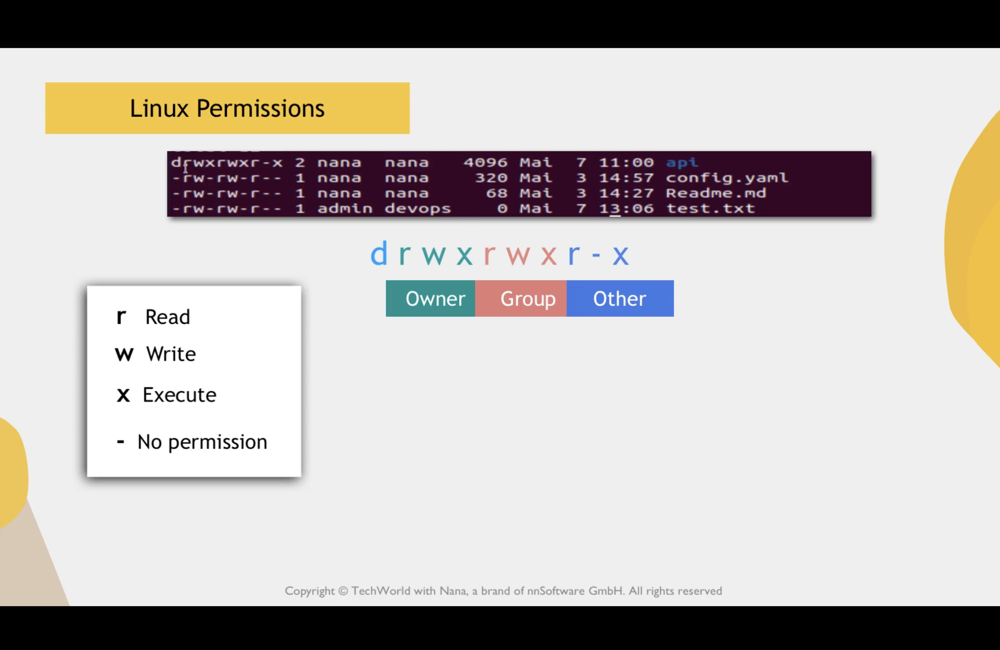
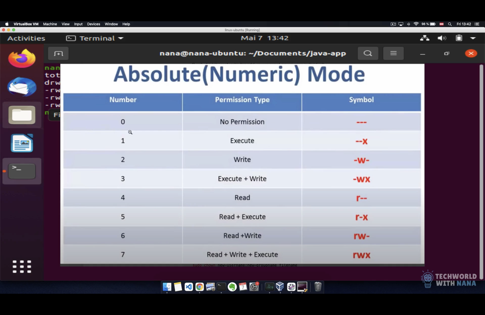

ls -l -> show list of permissions of files and folders 

In Linux, every file and directory has an owner and a group associated with it. This is called ownership.

3 types of owners -> u (users) , g (groups) , o (others)

--change owner of a particular file 

chown <username>:<groupname> <filename>

--chagne only the group

chgrp <groupname> <filename>

--LINUX PERMISSIONS--

d r w x r w x - x

d-> directory
- :-> normal file 
r -> read permission
w -> write permission 
x -> execute permisson
- :-> no permission

permission are divided into blocks 

d. rwx -> first block rwx -> for owner
   rwx -> second block -> for groups
   r-x -> others (others are who are not file owner or doesnt belong to group owners )

to visulalize more better ->  

--MODIFYING PERMISSIONS---

To change permission of an owner we use  | -> u 
To change premission of a group we use | -> g
To change permission of an other user | -> o

change permission for a group 

sudo chmod g-w <filename> |-> disable write permission to the group of the file 
notice we use "-" minus to remove permission to add permission we use "+"

sudo chmod a-x <filename> |-> remove execute permission from all owners 

-GIVE MULTIPLE PERMISSION IN ONE COMMAND

sudo chmod g=rwx <filename> 
sudo chmod g=r-- <filename>

--NUMERIC VALUES FOR PERMISSION

as the numeric values follows an order -> u g o 
e.g sudo chmod 740 <filename>
means for that filename -> 7 -> give all permission to users
                           4 -> give only read permission to groups
                           0 -> no permission to others